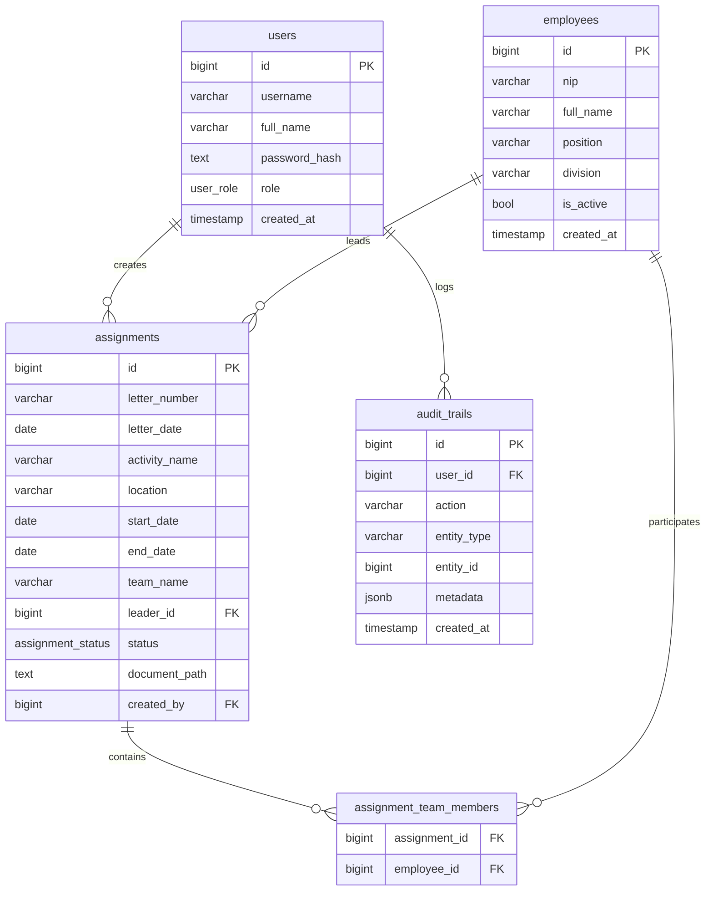

# ERD SIP-PEDAS

```mermaid
erDiagram
  users ||--o{ assignments : creates
  users ||--o{ audit_trails : logs
  employees ||--o{ assignments : leads
  assignments ||--o{ assignment_team_members : contains
  employees ||--o{ assignment_team_members : participates

  users {
    bigint id PK
    varchar username
    varchar full_name
    text password_hash
    user_role role
    timestamp created_at
  }

  employees {
    bigint id PK
    varchar nip
    varchar full_name
    varchar position
    varchar division
    bool is_active
    timestamp created_at
  }

  assignments {
    bigint id PK
    varchar letter_number
    date letter_date
    varchar activity_name
    varchar location
    date start_date
    date end_date
    varchar team_name
    bigint leader_id FK
    assignment_status status
    text document_path
    bigint created_by FK
  }

  assignment_team_members {
    bigint assignment_id FK
    bigint employee_id FK
  }

  audit_trails {
    bigint id PK
    bigint user_id FK
    varchar action
    varchar entity_type
    bigint entity_id
    jsonb metadata
    timestamp created_at
  }
```
